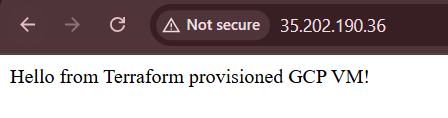

# 🚀 GCP VM Auto-Deployment with Terraform

This project automates the provisioning of a secure VM instance on Google Cloud using Terraform. It includes startup scripts, SSH access, and an Apache web server with a custom message.


---

## 📁 Project Structure

```
gcp-vm-autodeploy/
├── main.tf                # Terraform infrastructure definition
├── variables.tf           # Input variables
├── terraform.tfvars       # Variable values
├── startup-script.sh      # Script to install Apache and deploy message
├── README.md              # Setup and usage instructions
```

---

## 🛠️ Prerequisites

- Google Cloud project
- IAM role with Compute Admin + Service Account permissions
- Cloud Shell or local setup with:
  - `gcloud`
  - `terraform`

---

## 🚀 Setup Guide

### 1. Clone the repository

```bash
git clone https://github.com/Kshitija-0710/gcp-vm-autodeploy.git
cd gcp-vm-autodeploy
```

---

### 2. Set your GCP Project ID

Open `terraform.tfvars` and update with your project details:

```hcl
project_id = "your-gcp-project-id"
region     = "us-central1"
zone       = "us-central1-a"
```

Or pass it via CLI:
```bash
terraform apply -var="project_id=your-gcp-project-id"
```

---

### 3. Initialize Terraform

```bash
terraform init
```

---

### 4. Apply the Configuration

```bash
terraform apply -var="project_id=your-gcp-project-id"
```

Type `yes` when prompted to confirm.

---

### 5. Access the VM

After apply completes, you'll see an output like:

```
Outputs:
instance_ip = "34.123.45.67"
```

Open this IP in your browser:
```
http://34.123.45.67
```

You should see:
> Hello from Terraform provisioned GCP VM!

---

## 📸 Screenshot




## 🧹 Cleanup

To destroy all created resources:
```bash
terraform destroy -var="project_id=your-gcp-project-id"
```

---

## 📄 License

MIT License. Free to use and modify.

🧑‍💻 Author
Kshitija Randive
DevOps | GCP | AWS | CI/CD | Linux Automation

Built with ♥ for DevOps practice and portfolio enhancement.
